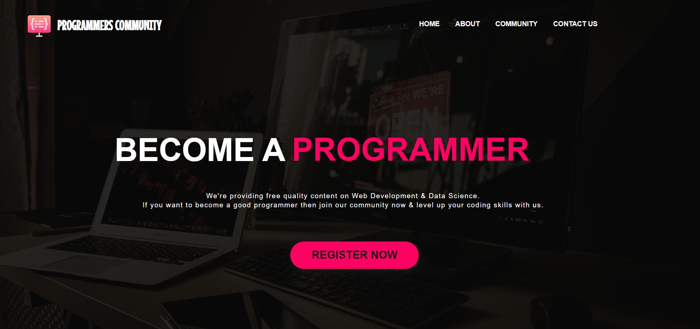

# Programmers Community Landing Page

Programmers Community Landing Page built using HTML and CSS.



## Table of Contents
- [About](#about)
- [Features](#features)
- [Preview](#preview)
- [Getting Started](#getting-started)
- [Project Structure](#project-structure)
- [Customization](#customization)
- [Contributing](#contributing)
- [License](#license)
- [Contact](#contact)

## About

This repository contains a simple, responsive landing page for a "Programmers Community" built with plain HTML and CSS. It is designed as a static site that can be used as a personal or community project landing page, a portfolio piece, or a template to extend.

## Features

- Clean, modern landing page layout
- Responsive design using CSS (no frameworks)
- Simple navigation and hero section
- Sections for features, about, and call-to-action

## Preview

See the screenshot above to get a quick idea of the design. To view the live layout, open `index.html` in your browser.

## Getting Started

To preview the project locally:

Option 1 — Open directly:
1. Clone the repository.
2. Open `index.html` in your web browser.

Option 2 — Serve with a simple HTTP server (recommended for correct asset loading):

Using Python 3:

```bash
# From the repository root
python -m http.server 8000
# Then open http://localhost:8000 in your browser
```

Or using Node (http-server):

```bash
npm install -g http-server
http-server -p 8000
# Then open http://localhost:8000
```

## Project Structure

- `index.html` — main landing page
- `styles/` or `.css` files — styling for the page
- `assets/` — images, icons, and other media (screenshot file included in repo)

(Adjust names if your repo uses a different structure.)

## Customization

- Edit `index.html` to change text, sections, or structure.
- Update the CSS files to change colors, spacing, fonts, and layout.
- Replace the screenshot and other media in the `assets` folder with your own images.

## Contributing

Contributions are welcome! If you want to improve the landing page, please open an issue or submit a pull request with your changes — e.g., accessibility improvements, responsive fixes, or additional sections.

## License

This project is open source — add a license (e.g., MIT) if you want to specify terms.

## Contact

Created by BinaryVortex. For questions or suggestions, open an issue in this repository.
